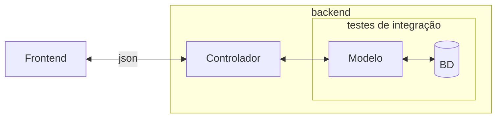

# ESM Forum

O **ESM Forum** é um sistema minimalista de demonstração do livro [Engenharia de Software Moderna](https://engsoftmoderna.info). 
Ele é um fórum simples de perguntas e respostas. O objetivo é permitir que os alunos tenham um primeiro contato prático com os conceitos estudados no livro. Ou seja:

* Trata-se de um sistema com objetivo didático e, por isso, não temos a intenção de colocá-lo em produção. 
* Também não temos a intenção de implementar um sistema completo, com todas as funcionalidades possíveis.

## Frontend
 
A interface do sistema é também muito simples, conforme  mostrado abaixo. 

O frontend está implementado, usando React, em um [repositório](https://github.com/mtov/esmforum-react) separado.

## Backend

O backend do sistema, que está neste repositório, usa JavaScript e também as seguintes tecnologias:

  * [Node.js](https://nodejs.org/en), um sistema que permite a execução de programas JavaScript fora de browsers, isto é, em servidores.
  * [Express](https://expressjs.com), uma biblioteca para construção de aplicações Web em Node.js.
  * [SQLite](https://www.sqlite.org), um banco de dados relacional simples.
  * [Jest](https://jestjs.io/), um framework para implementação de testes de unidade e de integração.

### Instalação e Execução do Backend

Veja neste [link](docs/instalacao.md).

## Testes de Integração

O ESM Forum possui alguns testes de integração, implementados 
usando o Jest. Para mais informações sobre esse tipo de teste 
consulte o 
[Capítulo 8](https://engsoftmoderna.info/cap8.html#testes-de-integra%C3%A7%C3%A3o)
do livro.

Os testes de integração estão implementados no arquivo
[modelo.test.js](testes/modelo.test.js).

Eles verificam a camada de modelo e o acesso da mesma ao banco de 
dados, conforme ilustrado a seguir:

## Executando os testes de integração

Primeiro, certifique-se de que instalou o backend do sistema, conforme explicado [aqui](docs/instalacao.md). 

Basta instalar o backend, isto é, para fins exclusivos deste teste, você não precisa 
rodar o servidor do lado backend. O motivo é que o teste vai testar apenas as funções
da camada de Modelo e o acesso delas ao banco de dados (veja figura acima)

Depois, digite na pasta raiz do projeto:

``npm test``

Para ver a cobertura dos testes, digite:

``npm test -- --coverage`` 

Para ver o relatório de cobertura, abra o arquivo:

`coverage/lcov-report/index.html`

Também é possível ver a cobertura no próprio código exibido pela IDE. Para isso, basta adicionar alguma extensão compatível. Um exemplo, para o VSCode, é a [Coverage Gutters](https://marketplace.visualstudio.com/items?itemName=ryanluker.vscode-coverage-gutters), que marca no próprio arquivo os trechos de código cobertos e os não cobertos pelos testes.

## Exercício

Após o rodar o comando acima, você vai perceber que a cobertura 
de comandos (Stmts) do arquivo `modelo.js` é de 78.26%.

Implemente então um ou mais casos de testes, sempre no 
arquivo [modelo.test.js](../testes/modelo.test.js), de forma que 
essa cobertura atinja 100%.
